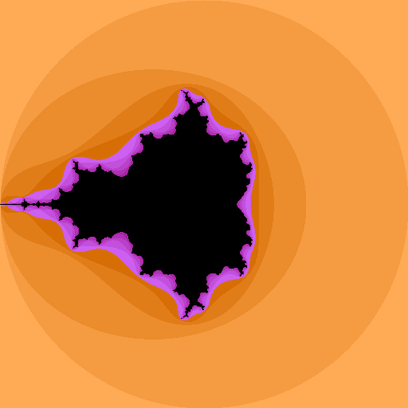

# Mandelbrot Set
There isn't any noticable difference. big.Rat takes an extremely long time, so I reduced the size to 512x512 and the number of iterations to 10.

```sh
go run main.go float32
go run main.go float64
go run main.go bigfloat
go run main.go bigrat
```
## Float32


## Float64


## big.Float


## big.Rat
