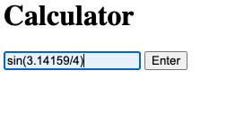

# Web-based Calculator
## UI


## Logs

```sh
$ go run main.go 
Expression: ((1.000000 + 2.000000) + ((3.000000 * 4.000000) / 5.000000))
Value: 5.400000
Expression: pow(2.000000, 10.000000)
Value: 1024.000000
Expression: sin((3.141590 / 4.000000))
Value: 0.707106
```