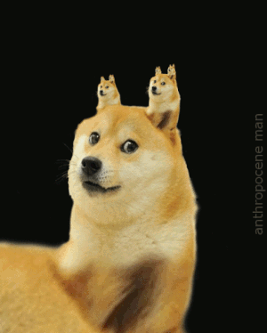
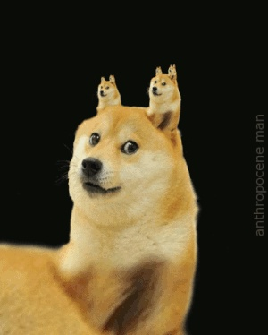

# Image File Converter
This script converts image files between jpeg, png, and gif formats.

## Example Usage

```sh
cat fixture/sample.gif | go run main.go >out.jpg
```

Before (GIF): 



After (JPEG):


